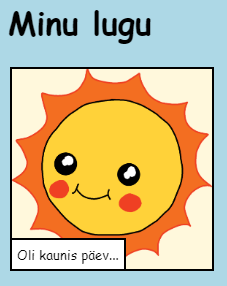

--- challenge ---

## Väljakutse: tee muudatusi

Oma veebilehe kohandamiseks muuda HTML ja CSS-koodi.

HTML-sisu võib leida `index.html` failist ja CSS-stiili `style.css` failist.

Võid ka muuta veebilehel kasutatud värve ja kasutada erinevaid fonte, näiteks:

+ Arial
+ Comic Sans MS
+ Impact
+ Tahoma

Leia rohkem CSS-i värvinimesid [siit](http://jumpto.cc/colours){:target="_blank"}.

--- /challenge ---