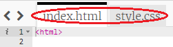

\--- väljakutse \---

## Väljakutse: tehke muudatusi

Kodulehe kohandamiseks muutke HTML-i ja CSS-koodi.

HTML-sisu võib leida `index.html-failist` ja CSS-stiilis faili `style.css`.

Võite ka muuta veebilehel kasutatud värve ja kasutada erinevaid fonte, näiteks:

+ Arial
+ Comic Sans MS
+ Mõju
+ Tahoma

Leia rohkem CSS-i värvimärke [siin](http://jumpto.cc/colours){: target = "_ blank"}.

\--- / väljakutse \---