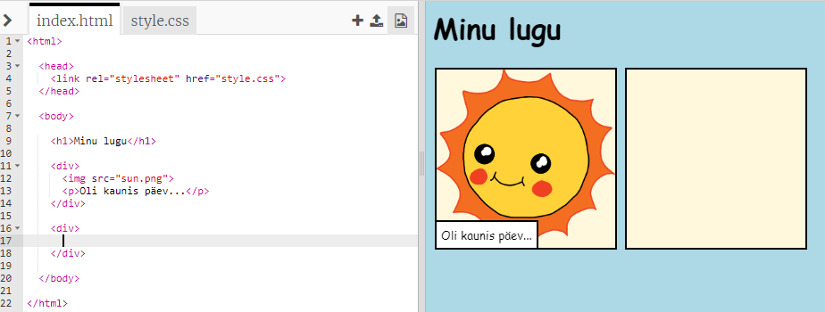
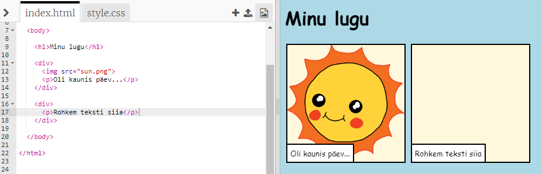
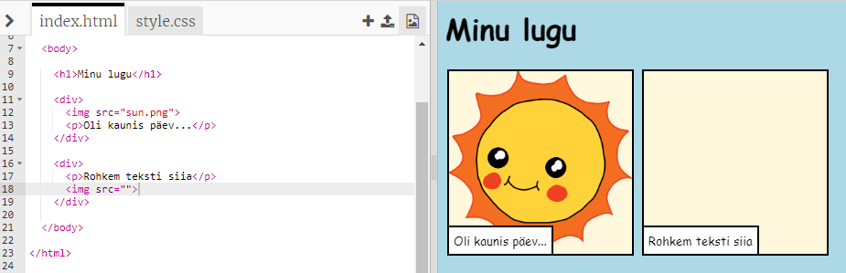
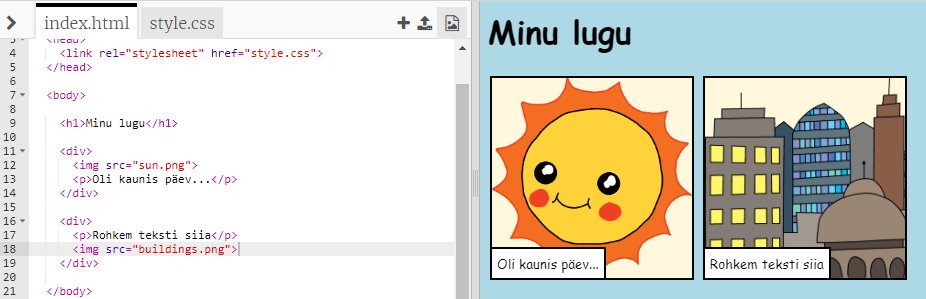

## Oma loo rääkimine

Lisame su loole teise osa.

+ Mine koodi 15. reale ja lisa teine komplekt `&lt;div&gt;` ja `&lt;/div&gt;` algus- ja lõppsilte. See loob uue kasti sinu loo järgmise osa jaoks.



+ Lisa oma uue sildi `&lt;div&gt;` sisse tekstilõik:

```html
&lt;p&gt;Veel teksti siia!&lt;/p&gt;
```



+ Uues kastis saad kuvada pildi, lisades selle koodi oma `&lt;div&gt;` sildi sees:

```html
&lt;img src=""&gt;
```



Pane tähele, et `&lt;img&gt;` sildid on teistest siltidest veidi erinevad: neil pole lõppsilti.

+ Pildi kuvamiseks pead lisama pildi **allika**(`src`) jutumärkide vahele.

Klõpsa pildiikoonil, et näha oma loo jaoks saadaval olevaid pilte.


+ Otsusta, millise pildi soovid lisada ja jäta selle nimi meelde, näiteks `ehitised.png`.

+ Koodi vaatamiseks klõpsa `index.html`-il, et oma koodi juurde tagasi jõuda.


+ Lisa pildi nimi oma `&lt;img&gt;` sildis olevate jutumärkide vahele.

```html
&lt;img src="buildings.png"&gt;
```

