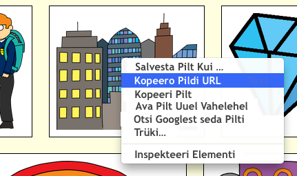

## Teie enda piltide leidmine

Looge oma veebis oleva pildi leidmiseks.

+ Mine [sellele lehele](http://jumpto.cc/html-images){: target = "_ blank"} ja leidke pilt, mida soovite oma lugu lisada.

+ Paremklõpsake pilti ja klõpsake **kopeeri pildi URL-i** (või **Kopeeri pildi aadress**, olenevalt kasutatavast arvutist). URL on pildi aadress.

+ Mine tagasi oma `index.html` lehele.

+ Kleepige URL-i oma silti `` kõnemärkide vahele. Sa peaksid nägema oma pilti!

