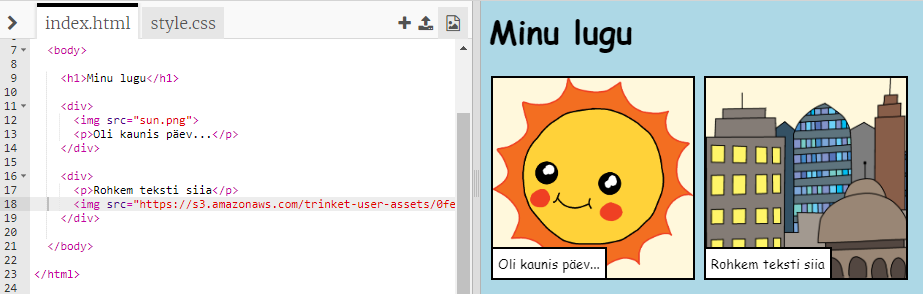

## Sinu enda piltide leidmine

Leiame pildi veebist, mida su loole lisada.

+ Mine [sellele lehele](http://jumpto.cc/html-images){:target="_blank"} ja leia pilt, mille soovid oma loole lisada.

+ Paremklõpsa pildil, seejärel klõpsa **kopeeri pildi URL** (või **kopeeri pildi aadress**, olenevalt kasutatavast arvutist). URL on pildi aadress.

+ Mine tagasi oma `index.html` lehele.

+ Kleebi URL oma `&lt;img&gt;` sildis olevate jutumärkide vahele. Sa peaksid nägema oma pilti ilmumas!

