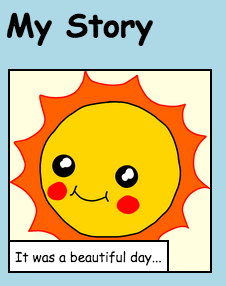

\--- چالش \---

## چالش: برخی از تغییرات را انجام دهید

کد HTML و CSS را برای سفارشی کردن صفحه وب خود ویرایش کنید.

محتوای HTML را می توان در فایل `index.html` و سبک CSS در `file style.css` شود.

شما همچنین می توانید رنگ های مورد استفاده در صفحه وب را تغییر دهید و می توانید از فونت های مختلف مانند:

+ Arial
+ کمیک بی سی MS
+ ضربه
+ طهما

یافتن نام رنگ CSS بیشتر [در اینجا](http://jumpto.cc/colours){: هدف = "_ خالی"}.

\--- \--- چالش \---