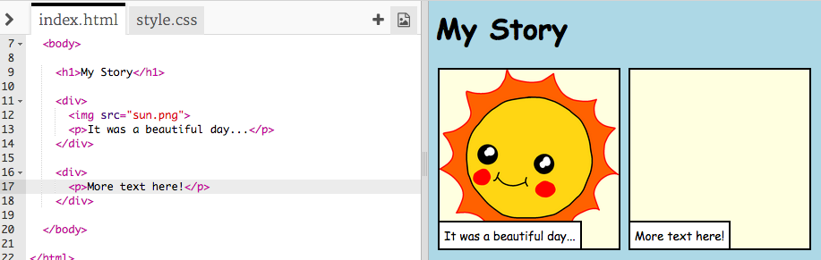

## داستان خود را بگویید

بیایید بخش دوم را به داستان خود اضافه کنیم.

+ به خط 15 کد بروید و در مجموعه دیگری از تگ های شروع و پایان `<div>` و `</div>` کنید. این یک جعبه جدید برای بخش بعدی داستان شما ایجاد خواهد کرد.


+ یک پاراگراف متن را در داخل جدید خود اضافه کنید `<div>` tag:

```html
<p>متن بیشتر در اینجا!</p>
```



+ شما می توانید یک تصویر را در کادر جدید خود نمایش دهید با اضافه کردن این کد در داخل تگ `<div>`:

```html

```


توجه داشته باشید که `` برچسب ها کمی متفاوت با برچسب های دیگر هستند: آنها یک تگ پایان ندارند.

+ برای دریافت یک تصویر برای نشان دادن، شما باید **منبع** (`src`) تصویر داخل عالمت های گفتار را اضافه کنید.

برای دیدن تصاویر موجود در داستان خود روی نماد تصویر کلیک کنید.


+ تصحیح تصویری که می خواهید اضافه کنید و نام آن را بخاطر بسپارید، برای مثال `buildings.png`.

+ روی `index.html` کلیک کنید تا به کد خود بازگردید


+ نام تصویر را بین نشانه های گفتاری در تگ ``.

```html

```

