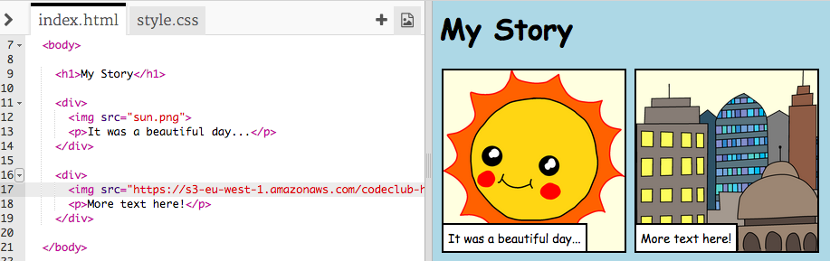

## پیدا کردن تصاویر خود را

بیایید یک تصویر در وب پیدا کنیم تا به داستان شما اضافه شود.

+ برو به [این صفحه](http://jumpto.cc/html-images){: target = "_ blank"}، و تصویری را که می خواهید در داستان خود وارد کنید پیدا کنید.

+ بر روی تصویر راست کلیک کرده و روی **Copy Image URL** (یا **Copy Image Address**، بسته به رایانه ای که استفاده می کنید) کلیک کنید. URL آدرس تصویر است.

+ بازگشت به خود را `index.html را` صفحه.

+ URL را بین علامت های گفتاری در تگ `` . شما باید تصویر خود را ببینید!

