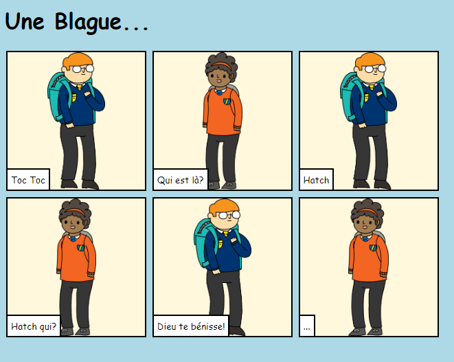

## Introduction

Dans ce projet, tu apprendras à créer ta propre page Web pour raconter une histoire, une blague ou un poème.

### Ce que tu feras

Fais défiler vers le bas dans le trinket pour voir la ligne de frappe!

  <iframe src="https://trinket.io/embed/html/998959ec74?outputOnly=true&start=result" width="600" height="450" frameborder="0" marginwidth="0" marginheight="0" allowfullscreen>
  </iframe>
  

### Ce que tu vas apprendre

Ce projet comprend des éléments des sections suivantes du [Programme de création numérique de Raspberry Pi](http://rpf.io/curriculum){:target="_blank"}:

+ [Concevoir des éléments de base en 2D et 3D](https://www.raspberrypi.org/curriculum/design/creator){:target="_blank"}.

### Informations supplémentaires pour les éducateurs

Si tu as besoin d'imprimer ce projet, utilise la [Version imprimable](https://projects.raspberrypi.org/fr-FR/projects/tell-a-story/print){:target="_blank"} .

Utilise le lien en bas de page pour accéder au dépôt GitHub pour ce projet, qui contient toutes les ressources (y compris un exemple d'un projet terminé) dans le dossier 'en/resources'.