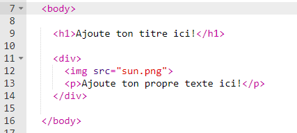
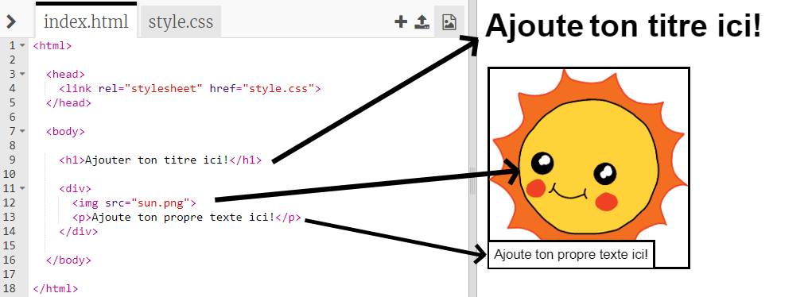

## Edite ton histoire

Commençons par éditer le contenu HTML et le style CSS de la page web de l'histoire

+ Ouvrir ce lien Trinket : <a href="http://jumpto.cc/web-story" target="_blank">jumpto.cc/web-story</a>.

Si tu es sur la version en ligne, tu peux aussi utiliser la version embarquée de Trinket:

 <iframe src="https://trinket.io/embed/html/8083cfebb3" width="100%" height="400" frameborder="0" marginwidth="0" marginheight="0" allowfullscreen>
 </iframe>

+ Comme tu l'as vu dans le project 'Bon anniversaire', le contenu de la page web doit être  entre les balises (ou 'tag') `<body>` et `</body>` (regarde la ligne 7 du code).

	

+ Peux tu citer les balises qui sont utilisées pour créer les différentes sections de la page web?

	

	+ `<h1>` est un __titre__. Tu peux utiliser les niveaux 1 à 6 pour créer des titres de tailles différentes;
	+ `
` est un raccourci pour __division__. C'est une façon de regrouper des éléments ensemble. Dans cette page web, tu l'utiliseras pour grouper les éléments de chaque partie de ton histoire;
	+ `` est une __image__;
	+ `
` est __paragraphe__ de texte.
