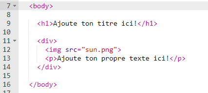

## Modifie ton histoire

Commençons par éditer le contenu HTML et le style CSS de la page Web de l'histoire.

+ Ouvre [ce trinket](https://trinket.io/html/36b6f5db62){:target="_blank"}.

Le projet devrait ressembler à ça:

Le contenu de la page Web se trouve dans la `<body>` section du document HTML `index.html`.

+ Cherche le contenu de la page Web à partir de la ligne 7, entre les balises `<body>` et `</body>`.

+ Vois si tu peux déterminer quelles balises sont utilisées pour créer les différentes parties de la page Web.

--- collapse ---
---
title: Réponse
---

+ `<h1>` est un **en-tête**. Tu peux utiliser les chiffres 1 à 6 pour créer des en-têtes de différentes tailles.
+ `
` est l'abréviation de **division**, et est une façon de regrouper des choses. Dans cette page Web, tu vas l'utiliser pour regrouper tous les éléments de chaque partie de ton histoire.
+ `` est une **image**.
+ `
` est un **paragraphe** du texte.

--- /collapse ---