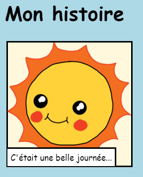
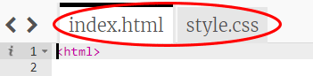

--- challenge ---

## Défi: apporter quelques changements

Modifie le code HTML et CSS pour personnaliser ta page Web.

Le contenu HTML se trouve dans le fichier `index.html` et le style CSS dans le fichier `style.css`.

Tu peux également modifier les couleurs utilisées dans la page Web et utiliser différentes polices, telles que:

+ Arial
+ Comic Sans MS
+ Impact
+ Tahoma

Tu peux trouver plus de noms de couleurs CSS [ici](http://jumpto.cc/colours){:target="_blank"}.

--- /challenge ---