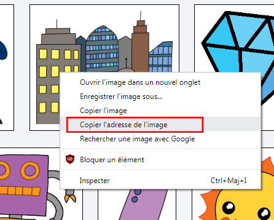
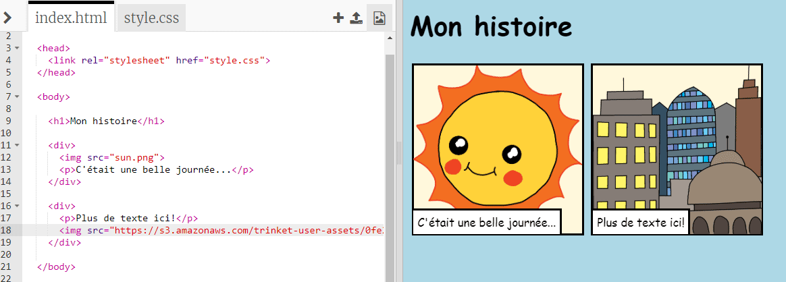

## Raconte ton histoire

Ajoutons une partie à ton histoire.

+ Va à la ligne 17 du code, et ajoute une balise ouvrante `<div>`, puis une balise fermante `</div>`

	

+ Ajoute un paragraphe de texte dans ta nouvelle balise `<div>`.

	

+ Pour finir, tu peux ajouter une image dans ta nouvelle partie, en ajoutant ce code dans ta balise `<div>`:

	```
	
	```

	As tu remarqué que les balises `` sont un peu différentes des autres balises? En effet, elles n'ont pas pas de balise fermante!

+ Pour utiliser une image d'internet, il faut que tu ajoutes entre guillemets dans ta balise sa __source__, c'est à dire son adresse (on dit aussi URL).
	Suis ce lien <a href="http://jumpto.cc/web-images" target="_blank">jumpto.cc/web-images</a>, et choisis une image que tu aimerais ajouter à ton histoire.

+ Fais un clic droit sur l'image, et choisis 'copier l'adresse de l'image'.
	

+ Colle l'adresse entre les guillemets dans ta balise ``. Tu devrais voir ton image apparaître!

	

+ __Si tu as un compte Trinket__, tu peux aussi ajouter tes propres images à ta page! Il te suffit de cliquer sur l'icône image dans trinket et ensuite cliquer sur 'télécharger' (ou 'upload')

	

+ Trouve ton image sur ton ordinateur, puis dépose la dans Trinket

	

+ Tu n'as ensuite plus qu'à ajouter le nom de ta nouvelle image entre guillemets dans ta balise ``, comme ceci

	```
	
	```
