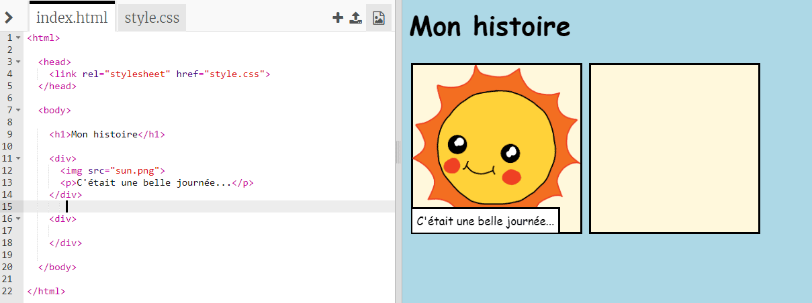
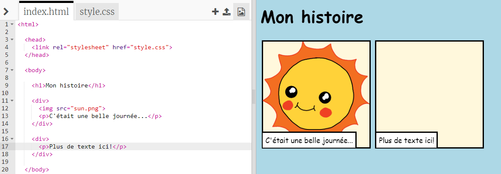
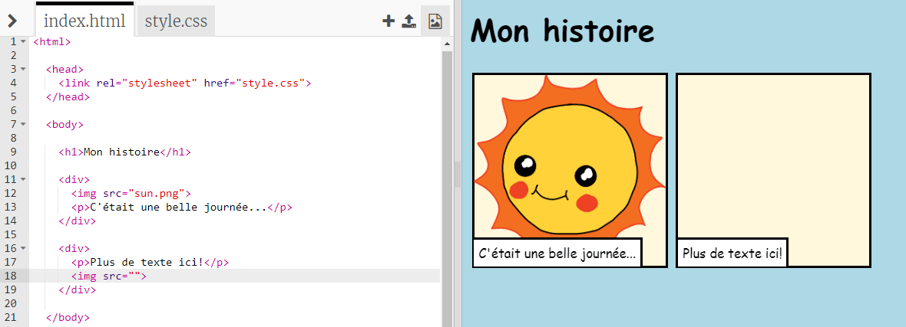
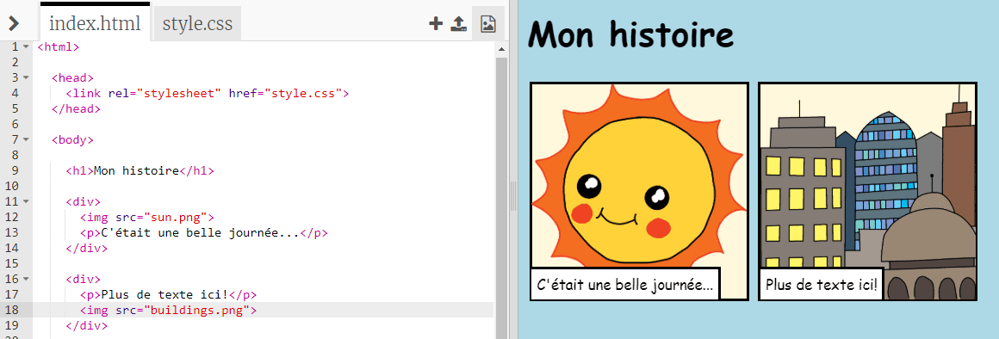

## Raconte ton histoire

Ajoutons une deuxième partie à ton histoire.

+ Va à la ligne 15 du code et ajoute un autre lot de balises de début et de fin `<div>` et `</div>`. Cela créera une nouvelle boîte pour la prochaine partie de ton histoire.



+ Ajoute un paragraphe de texte dans ta nouvelle balise `<div>`:

```html
<p> Plus de texte ici! </p>
```



+ Tu peux afficher une image dans ta nouvelle boîte en ajoutant ce code dans ta balise `<div>`:

```html

```



Note que les balises `` sont un peu différentes des autres balises: elles n’ont pas de balise de fin.

+ Pour faire apparaître une image, tu dois ajouter la **source** (`src`) de l'image à l'intérieur des repères de parole.

Clique sur l'icône de l'image pour voir les images disponibles pour ton histoire.


+ Décide quelle image tu veux ajouter et rappelle toi son nom, par exemple `buildings.png` .

+ Clique sur `index.html` pour revenir à ton code.


+ Ajoute le nom de l'image entre les marques de parole dans ta balise ``.

```html

```

