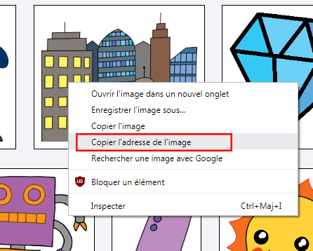
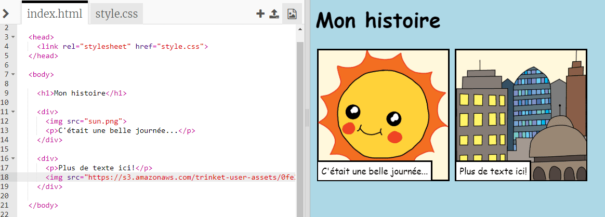

## Trouver tes propres images

Trouvons une image sur le Web à ajouter à ton histoire.

+ Va à [ cette page ](http://jumpto.cc/html-images) {: target = "_ blank"} et trouve une image à inclure dans ton récit.

+ Fais un click-droit sur l'image, puis clique sur ** Copier l'URL de l'image. ** (ou ** Copier l'adresse de l'image ** , selon l’ordinateur que tu utilises). L'URL est l'adresse de l'image.

+ Retourne à ta page ` index.html `.

+ Colle l'URL entre les marques de parole dans ta balise ``. Tu devrais voir ton image apparaître!

