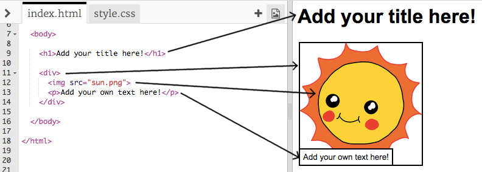

## अपनी कहानी का संपादन

आइए कहानी के वेबपेज की HTML सामग्री और CSS शैली को संपादित करने से शुरू करते है।

+ खोलें [यह ट्रिंकेट](https://trinket.io/html/d54c44dcaf){:target="_blank"}।

परियोजना इस तरह दिखनी चाहिए:

वेबपेज कंटेंट `index.html` HTML डॉक्यूमेंट के `<body>` सेक्शन में जाता है ।

+ लाइन ७ के बाद से `<body>` और `</body>` टैग के अंदर वेबपृष्ठ सामग्री खोजें।

+ देखें कि क्या आप वेबपेज के विभिन्न हिस्सों को बनाने के लिए किन टैग्स का उपयोग कर सकते हैं।

--- collapse ---
---
title: उत्तर
---

+ `<h1>` एक **शीर्षक** है । विभिन्न आकारों के शीर्षकों को बनाने के लिए आप संख्या १ से ६ का उपयोग कर सकते हैं।
+ `
` **विभाजन** के लिए छोटा है, और सामान को एक साथ समूहीकृत करने का एक तरीका है। इस वेबपेज में, आप इसे अपनी कहानी के प्रत्येक भाग के लिए सभी सामानों के समूह में उपयोग करेंगे।
+ `` एक **छवि** है ।
+ `
` पाठ का एक **अनुच्छेद** है ।

--- /collapse ---