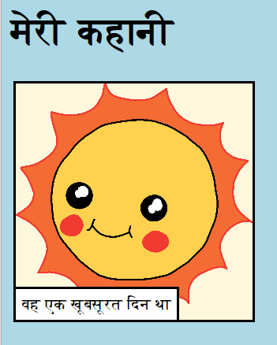

\--- challenge \---

## चुनौती: कुछ बदलाव करें

अपने वेबपृष्ठ को अनुकूलित करने के लिए HTML और CSS कोड संपादित करें।

HTML सामग्री `index.html` में पाई जा सकती है, और `style.css` फ़ाइल में CSS शैली ।

आप वेबपृष्ठ में उपयोग किए गए रंगों को भी बदल सकते हैं, और आप विभिन्न फोंट का उपयोग कर सकते हैं जैसे:

+ एरियल(Arial)
+ कॉमिक संस एमएस(Comic Sans MS)
+ इंपैक्ट(Impact)
+ तहोमा(Tahoma)

आप अधिक सीएसएस(CSS) रंग के नाम [यहां](http://jumpto.cc/colours){:target="_blank"} पा सकते हैं ।

\--- /challenge \---