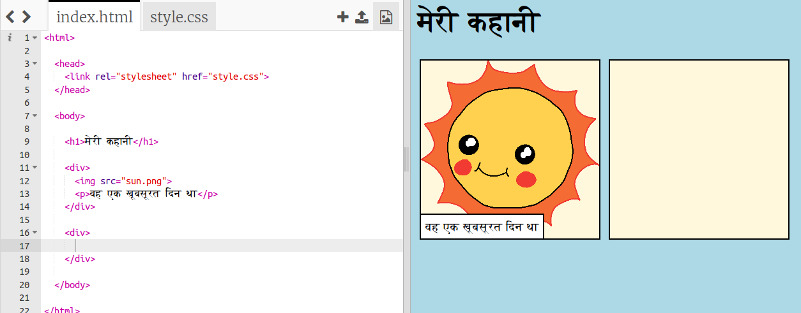
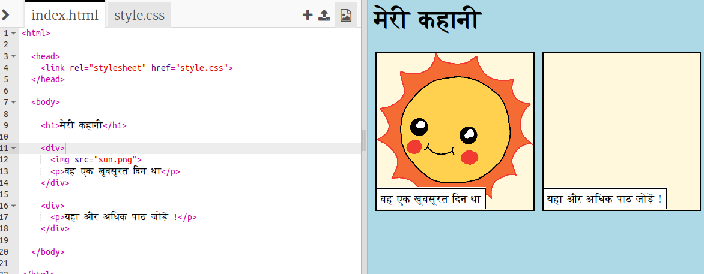
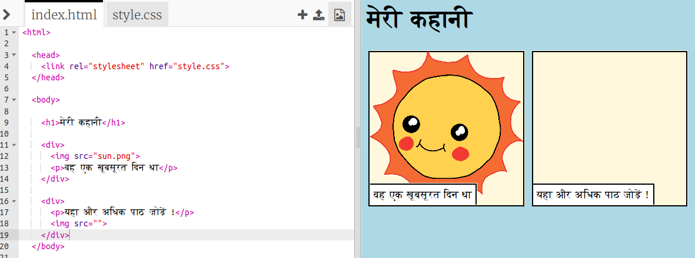
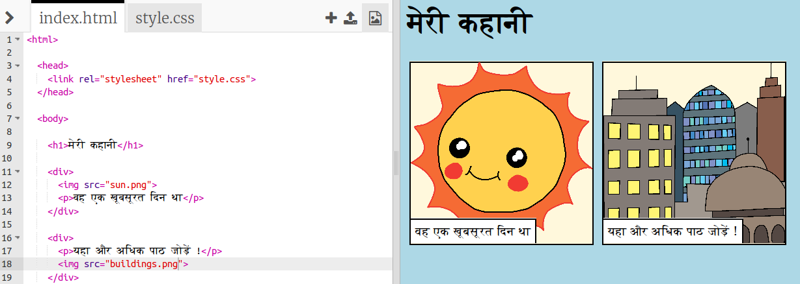

## अपनी कहानी बताना

आइए अपनी कहानी में एक दूसरा भाग जोड़ते हैं।

+ कोड की पंक्ति 15 पर जाएं, और एक और `<div>` और `</div>` प्रारंभ और समाप्ति टैग जोड़ें। यह आपकी कहानी के अगले भाग के लिए एक नया बॉक्स बनाएगा।



+ `<div>` टैग के अंदर टेक्स्ट का पैराग्राफ जोड़ें:

```html
<p>More text here!</p>
```



+ आप अपने `<div>` टैग के अंदर इस कोड को जोड़कर अपने नए बॉक्स में एक चित्र प्रदर्शित कर सकते हैं:

```html

```



ध्यान दें कि `` टैग अन्य टैग्स से थोडे अलग हैं: उनके पास एक अंतिम टैग नहीं है।

+ एक चित्र को दिखाने के लिए, आपको चित्र के **source** (`src`) को उद्धरण चिह्न के अंदर जोड़ना होगा ।

अपनी कहानी के लिए उपलब्ध चित्रों को देखने के लिए चित्र आइकन पर क्लिक करें।


+ तय करें कि आप किस चित्र को जोड़ना चाहते हैं और उसका नाम याद रखें, उदाहरण के लिए `buildings.png`।

+ अपने कोड पर वापस जाने के लिए `index.html` पर क्लिक करें।


+ फिर अपने `` टैग के उद्धरण चिह्न के बीच अपने नए चित्र का नाम जोड़ें।

```html

```

