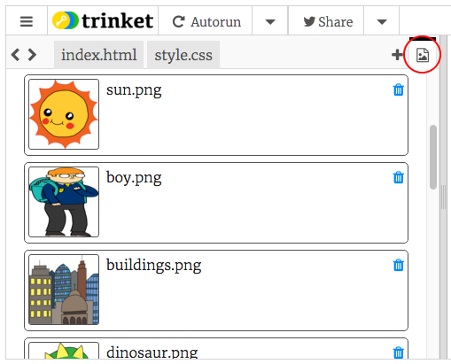

## अपनी कहानी बताना

आइए अपनी कहानी में एक दूसरा भाग जोड़ते हैं।

+ Go to line 15 of the code, and add in another set of `<div>` and `</div>` start and end tags. This will create a new box for the next part of your story.


+ अपने नए `&lt;div&gt;` टैग के अंदर पाठ का एक अनुच्छेद जोड़ें:

```html
&lt;p&gt; अधिक पाठ यहां! &lt;/p&gt;
```


+ आप अपने `&lt;div&gt;` टैग के अंदर इस कोड को जोड़कर अपने नए बॉक्स में एक छवि प्रदर्शित कर सकते हैं:

```html
&lt;img src=""&gt;
```


ध्यान दें कि `&lt;img&gt;` टैग अन्य टैग्स से थोडे अलग हैं: उनके पास एक अंतिम टैग नहीं है।

+ To get an image to show up, you need to add the **source** (`src`) of the image inside the speech marks.

Click the image icon to see the images available for your story.



+ Decide which image you want to add and remember its name, for example `buildings.png`.

+ Click on `index.html` to get back to your code.


+ Add the name of the image between the speech marks in your `` tag.

```html

```

