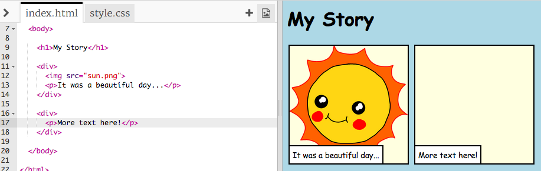

## अपनी कहानी बताना

आइए अपनी कहानी में एक दूसरा भाग जोड़ते हैं।

+ कोड की पंक्ति 15 पर जाएं, और दूसरे सेट में `<div>` और `</div>` टैग शुरू करें और समाप्त करें । यह आपकी कहानी के अगले भाग के लिए एक नया बॉक्स बनाएगा।


+ अपने नए `<div>` टैग के अंदर पाठ का एक अनुच्छेद जोड़ें:

```html
<p>अधिक पाठ यहां!</p>
```



+ आप अपने `<div>` टैग के अंदर इस कोड को जोड़कर अपने नए बॉक्स में एक छवि प्रदर्शित कर सकते हैं:

```html

```


ध्यान दें कि `` टैग अन्य टैग्स से थोडे अलग हैं: उनके पास एक अंतिम टैग नहीं है।

+ दिखाने के लिए एक छवि प्राप्त करने के लिए, आपको छवि की **स्रोत(source)**(`src`) को भाषण के निशान के अंदर जोड़ना होगा ।

अपनी कहानी के लिए उपलब्ध चित्रों को देखने के लिए छवि आइकन पर क्लिक करें।


+ यह तय करें कि आप किस छवि को जोड़ना चाहते हैं और उसका नाम याद रखें, उदाहरण के लिए `buildings.png` ।

+ अपने कोड को वापस पाने के लिए `index.html` पर क्लिक करें ।


+ फिर अपने `` टैग में भाषण के निशान के बीच अपनी नई छवि का नाम जोड़ें ।

```html

```

