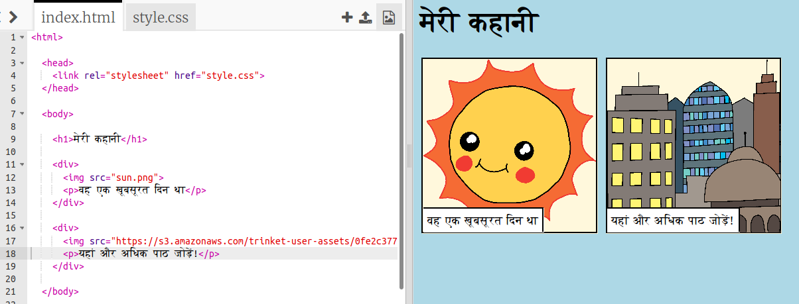

## अपनी खुद की छवियां ढूंढना

आइए अपनी कहानी में जोड़ने के लिए वेब पर एक छवि खोजें।

+ [इस पृष्ठ](http://jumpto.cc/html-images){:target="_blank"} पर जाएं, और एक छवि खोजें जो आप अपने कहानी में शामिल करना चाहते हैं।

+ छवि पर राइट-क्लिक करें, और **छवि URL की प्रतिलिपि बनाएँ(Copy Image URL)** पर क्लिक करें (या **छवि पता कॉपी करें(Copy Image Address)**, आपके द्वारा उपयोग किए जा रहे कंप्यूटर पर निर्भर करता है)। URL छवि का पता है।

+ अपने `index.html` पृष्ठ पर वापस जाएं ।

+ अपने `` टैग में भाषण के निशान के बीच URL चिपकाएँ। आपको अपनी छवि दिखाई देनी चाहिए!

