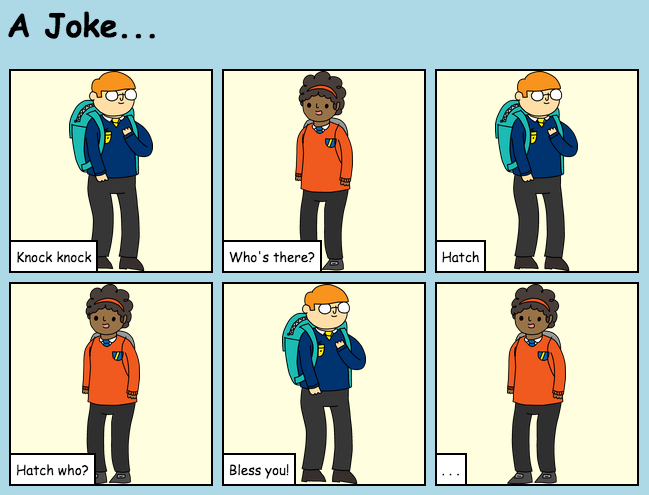

## Uvod

U ovom projektu naučit ćete kako napraviti vlastitu web-stranicu kako biste ispričali priču, vic ili pjesmu.

### Napravit ćeš

Pomaknite se dolje na dno trinket stranice da vidite u čemu je poanta!

  <iframe src="https://trinket.io/embed/html/c8afdef912?outputOnly=true&start=result" width="600" height="450" frameborder="0" marginwidth="0" marginheight="0" allowfullscreen>
  </iframe>
  

### Naučit ćeš

This project covers elements from the following strands of the [Raspberry Pi Digital Making Curriculum](https://rpf.io/curriculum){:target="_blank"}:

+ [Design basic 2D and 3D assets](https://www.raspberrypi.org/curriculum/design/creator){:target="_blank"}.

### Dodatne informacije za voditelje kluba

Ako želite ispisati ovaj projekt, koristite [verziju koja je prilagođena za ispis](https://projects.raspberrypi.org/en/projects/tell-a-story/print){:target="_blank"} .

Koristite poveznicu u podnožju da bi pristupili GitHub repozitoriju ovog projekta koji sadrži sve resurse (uključujući i primjer dovršenog projekta) u mapi 'hr-Hr/resources'.