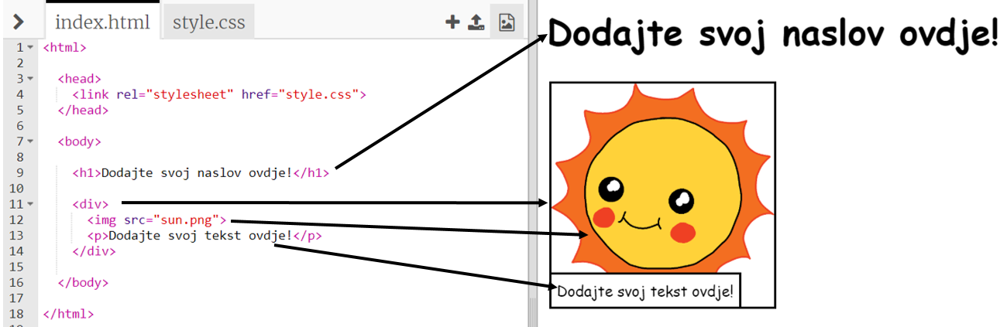

## Uredite svoju priču

Počnimo uređivanjem HTML sadržaja i CSS stila web stranice priče.

+ Otvorite [ovaj trinket](http://jumpto.cc/web-story){:target="_blank"}.

Projekt bi trebao izgledati ovako:

Sadržaj web-stranice ide u `<body>` odjeljak `index.html` HTML dokumenta.

+ Pronađite sadržaj web stranice od retka 7 nadalje, unutar `<body>` i `</body>` oznake.

+ Pogledajte možete li odrediti koje se oznake koriste za stvaranje različitih dijelova web-stranice.

## \--- collapse \---

## naslov: Odgovor

+ `<h1>` je **heading**. Možete koristiti brojeve od 1 do 6 za stvaranje naslova različitih veličina.
+ `
` je skraćenica za ** podjela ** i to je način grupiranja stvari. Na ovoj web stranici upotrebljavat ćete je za grupiranje svih elemenata za svaki dio vaše priče.
+ `` je **slika**.
+ `
` je **odlomak** teksta.

\--- /collapse \---