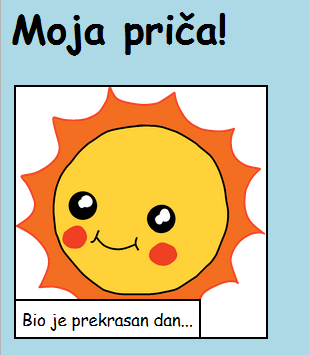

\--- challenge \---

## Izazov: napravi neke promjene

Uredite HTML i CSS kôd da biste prilagodili svoju web stranicu.

HTML sadržaj možete pronaći u `index.html` datoteci, a CSS stil u `style.css` datoteci.

Također možete promijeniti boje koje se koriste na web stranici, a možete koristiti i različite fontove kao što su:

+ Arial
+ Comic Sans MS
+ Impact
+ Tahoma

Više naziva CSS boja možete pronaći [ovdje](http://jumpto.cc/colours){:target="_ blank"}.

\--- /challenge \---