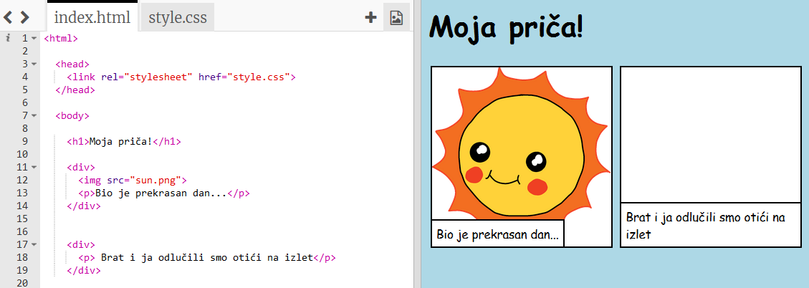
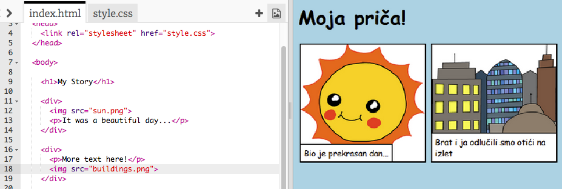

## Ispričaj svoju priču

Dodajmo drugi dio priče.

+ Idite na 15. redak koda i dodajte novi skup `<div>` i `</div>` početne i završne oznake. Ovo će stvoriti novi odjeljak za sljedeći dio vaše priče.


+ Dodajte odlomak teksta unutar nove oznake `<div>`:

```html
<p>Više teksta ovdje!</p>
```



+ Možete prikazati sliku u novom okviru dodavanjem ovog koda unutar oznake `<div>`:

```html

```


Primjetite da su oznake `` malo drugačije od ostalih oznaka: nemaju završnu oznaku.

+ Da biste prikazali sliku, morate dodati **izvor** (`src`) slike unutar navodnika.

Kliknite ikonu slike da biste vidjeli slike dostupne za vašu priču.


+ Odlučite koju sliku želite dodati i zapamtite njeno ime, na primjer `buildings.png`.

+ Kliknite `index.html` da biste se vratili svom kodu.


+ Dodajte naziv slike između navodnika unutar oznake ``.

```html

```

