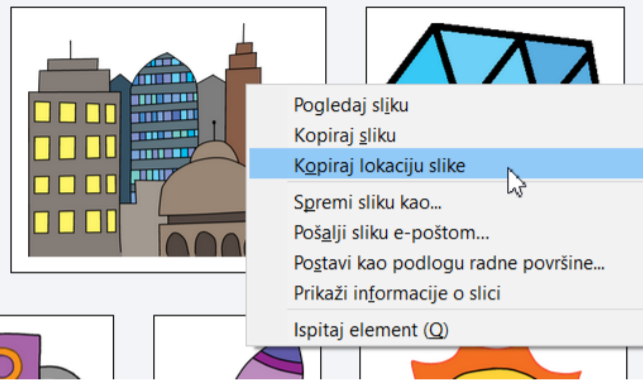
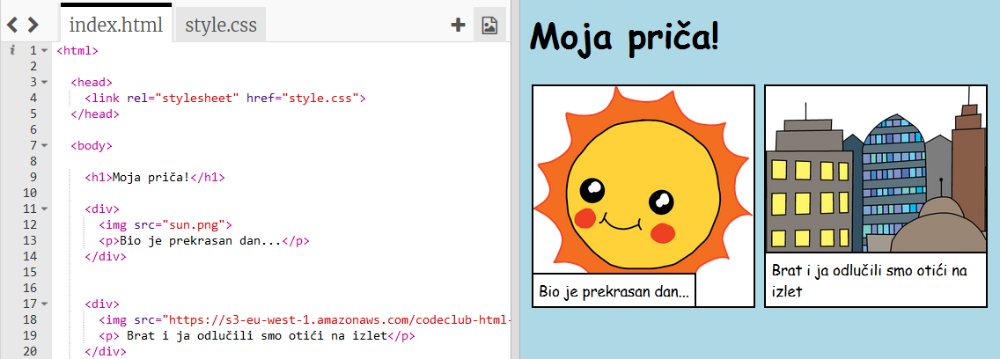

## Pronalaženje vlastitih slika

Pronaći ćemo sliku na webu kako bismo je dodali u vašu priču.

+ Idite na [ovu stranicu](http://jumpto.cc/html-images){: target = "_ blank"} i pronađite sliku koju želite uključiti u svoju priču.

+ Desnom tipkom miša kliknite sliku i kliknite **Kopiraj URL slike** (ili **Kopiraj adresu slike**, ovisno o računalu koje koristite). URL je adresa slike.

+ Vratite se na `index.html` stranica.

+ Zalijepite URL između oznaka govora u oznaku ``. Trebali biste vidjeti svoju sliku!

