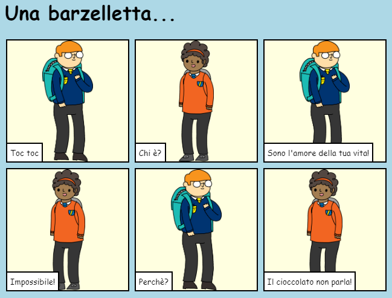

## Introduzione

In questo progetto, imparerai a creare la tua pagina web per raccontare una storia, barzelletta o poesia.

### Cosa farai

Scorri verso il basso nel trinket per vedere come finisce la storia!

  <iframe src="https://trinket.io/embed/html/c8afdef912?outputOnly=true&start=result" width="600" height="450" frameborder="0" marginwidth="0" marginheight="0" allowfullscreen>
  </iframe>
  

### Che cosa imparerai

This project covers elements from the following strands of the [Raspberry Pi Digital Making Curriculum](https://rpf.io/curriculum){:target="_blank"}:

+ [Risorse base di design 2D e 3D](https://www.raspberrypi.org/curriculum/design/creator){:target="_blank"}.

### Informazioni aggiuntive per gli educatori

Se intendete stampare questo progetto, cliccate su [Versione stampabile](https://projects.raspberrypi.org/en/projects/tell-a-story/print){:target = "_ blank"} .

Clicca il link a piè di pagina per accedere al repository di GitHub relativo a questo progetto, che contiene tutte le risorse necessarie (incluso un esempio di progetto completo) nella cartella 'en/resources'.