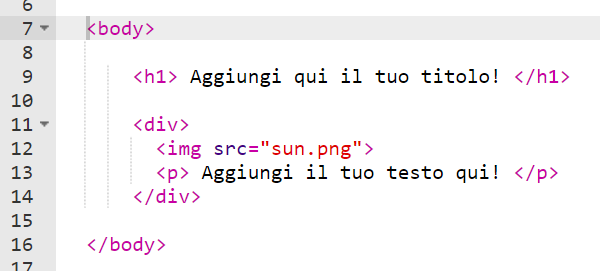

## Scrittura della storia

Iniziamo modificando il contenuto HTML e lo stile CSS della pagina Web della storia.

+ Apri questo trinket: <a href="http://jumpto.cc/web-story" target="_blank">jumpto.cc/web-story</a>.

	Il progetto si presenta così:

	

+ Forse ti ricorderai dal progetto "Buon compleanno" che il contenuto di una pagina Web è incluso nel tag `<body>` del documento HTML.

	Vai alla riga 7 del codice. Dovresti essere in grado di visualizzare il contenuto della pagina Web all’interno dei tag `<body>` e `</body>`.

	

+ Sapresti dire quali tag sono utilizzati per creare le diverse parti della pagina Web?

	

	+ `<h1>` rappresenta una __heading__ (intestazione). Puoi utilizzare i numeri da 1 a 6 per creare intestazioni di diverse dimensioni;
	+ `
` è l’abbreviazione di __division__ (divisione) e serve per raggruppare diversi elementi insieme. In questa pagina Web, utilizzerai questo tag per raggruppare tutti gli elementi di ogni parte della storia;
	+ `` sta per __image__ (immagine);
	+ `
` indica un __paragraph__ (paragrafo) di testo.
