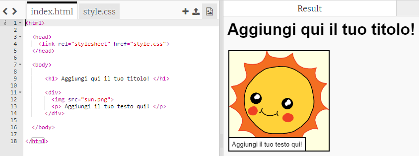
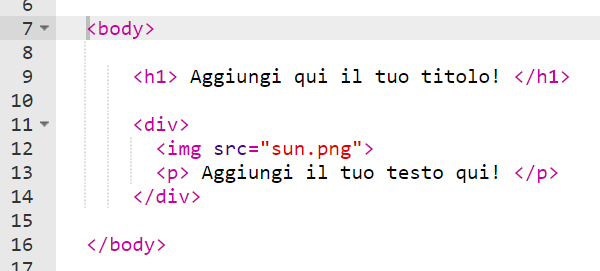
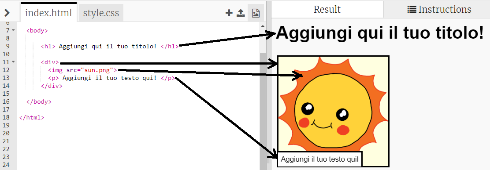

## Fare modifiche alla tua storia

Iniziamo modificando il contenuto HTML e lo stile CSS della pagina web della storia.

+ Apri [questo trinket](http://jumpto.cc/web-story){:target="_blank"}.

Il progetto dovrebbe assomigliare a questo:

Il contenuto della pagina web va nella sezione `<body>` del documento HTML `index.html`.

+ Troverai il contenuto della pagina web dalla riga 7 in poi, dentro i tag `<body>` e `</body>`.

+ Prova a capire quali sono i tag da usare per creare le diverse parti della pagina web.

## \--- collapse \---

## title: Risposta

+ `<h1>` è un'**intestazione**. Puoi usare i numeri da 1 a 6 per creare intestazioni di misure differenti.
+ `
` è l'abbreviazione di **divisore** ed è un modo di raggruppare vari elementi. In questa pagina, lo userai per mettere insieme tutti gli elementi di ogni parte della tua storia.
+ `` è un'**immagine**.
+ `
` è un **paragrafo** del testo.

\--- /collapse \---