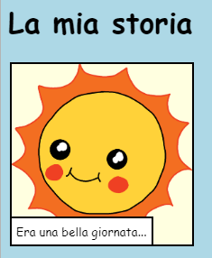

\--- challenge \---

## Sfida: fai delle modifiche

Modifica il codice HTML e CSS per personalizzare la tua pagina web.

Puoi trovare il codice HTML nel file `index.html`, e quello CSS nel file `style.css`.

Puoi anche cambiare i colori usati nella pagina, e puoi usare vari caratteri come:

+ Arial
+ Comic Sans MS
+ Impact
+ Tahoma

Trova altri nomi di colori CSS [qua](http://jumpto.cc/colours){:target="_blank"}.

\--- /challenge \---