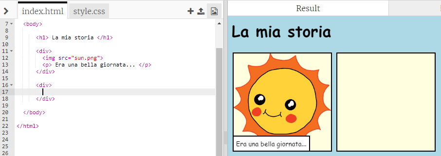
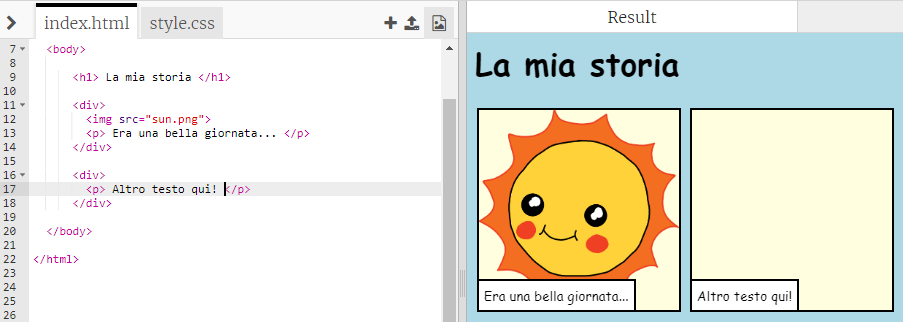

## Racconta la tua storia

Aggiungiamo ora una seconda parte alla storia.

+ Vai alla riga 15 del codice e aggiungi un’altra coppia di tag `<div>` e `</div>` di apertura e chiusura. Verrà creata una nuova casella per la parte successiva della storia.

	

+ Aggiungi un paragrafo di testo all’interno del nuovo tag `<div>`.

	```
	<p>Aggiungi qui del testo!</p>
	```

	

+ Puoi infine aggiungere un’immagine nella nuova casella aggiungendo questa sintassi all’interno del tag `<div>`:

	```
	
	```

	

	I tag `` sono leggermente diversi dagli altri, in quanto non dispongono di un tag di chiusura.

+ Per le immagini in HTML, dovrai aggiungere la __fonte__ dell’immagine, all’interno delle virgolette.

	Fai clic sull’icona delle immagini per visualizzare le immagini disponibili per la tua storia.

	

+ Trova il nome di un’immagine che desideri aggiungere, ad esempio `buildings.png`. Fai clic su `index.html` per tornare al codice.

	

+ Puoi quindi aggiungere il nome dell’immagine tra le virgolette del tag ``.

	```
	
	```

	
