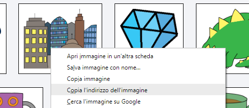
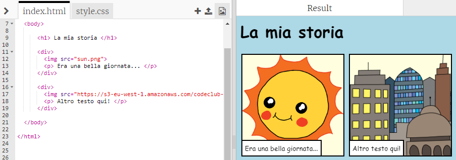

## Trova le immagini che desideri

Cerchiamo un’immagine sul Web da aggiungere alla storia.

+ Vai a <a href="http://jumpto.cc/html-images" target="_blank">jumpto.cc/html-images</a> e trova un’immagine che desideri includere nella storia.

+ Fai clic con il tasto destro del mouse sull’immagine e quindi su "Copy image URL" (Copia URL dell'immagine). L’__URL__ è l’indirizzo dell’immagine.

	

+ Incolla l’URL tra le virgolette del tag ``. Dovrebbe apparire l’immagine!

	
