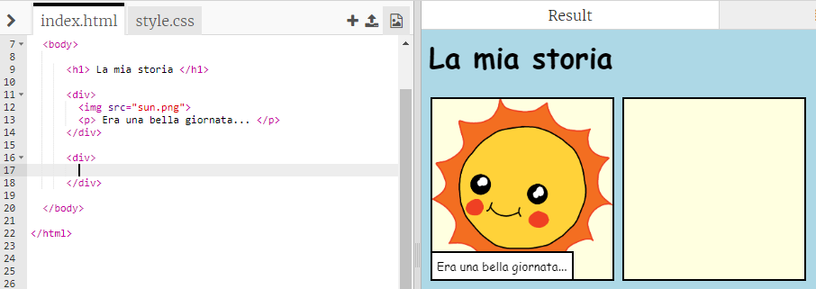
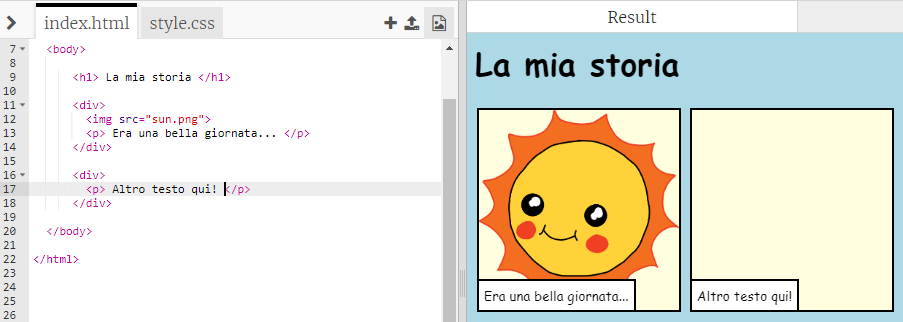
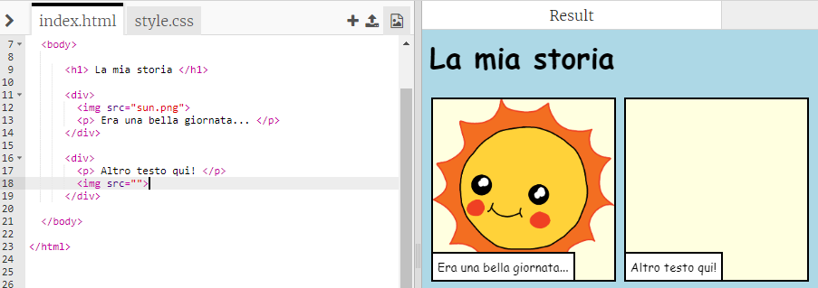
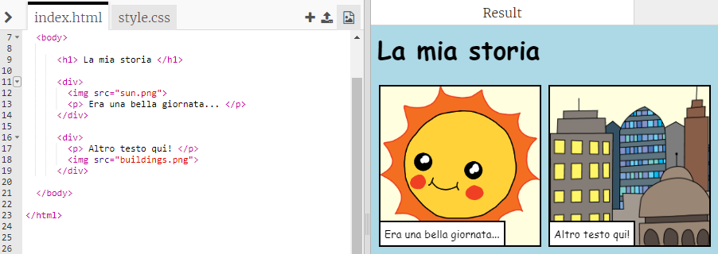

## Raccontare la tua storia

Aggiungiamo una seconda parte alla tua storia.

+ Vai alla riga 15 del codice e aggiungi un'altra coppia di tag di inizio `<div>` e di fine `</div>`. Questo creerà un nuovo "contenitore" per la parte successiva della tua storia.



+ Aggiungi un paragrafo di testo nel nuovo tag `<div>`:

```html
<p>Altro testo qui!</p>
```



+ Puoi inserire un'immagine nel tuo nuovo contenitore aggiungendo questo codice nel tag `<div>`:

```html

```



Fai attenzione che i tag `` sono un po' diversi dagli altri: non hanno un tag di fine.

+ Per rendere visibile un'immagine, devi aggiungere la **posizione d'origine** (`src`) dell'immagine dentro le virgolette.

Clicca sull'icona delle immagini per vedere le immagini disponibili per la tua storia.


+ Decidi quale immagine aggiungere e ricordati il suo nome, per esempio `buildings.png`.

+ Clicca su `index.html` per tornare al tuo codice.


+ Aggiungi il nome dell'immagine tra le virgolette nel tuo tag ``.

```html

```

