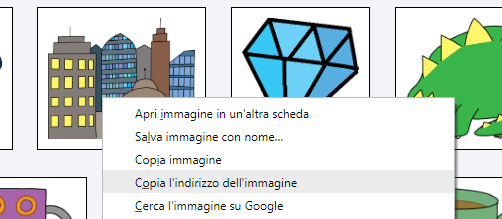
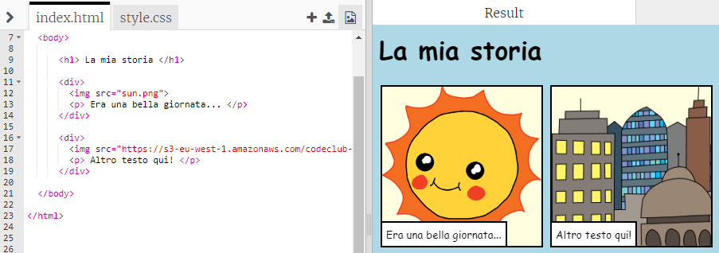

## Cerca le tue immagini

Cerchiamo un'immagine su Internet da aggiungere alla tua storia.

+ Vai su [questa pagina](http://jumpto.cc/html-images){:target="_blank"}, e trova un'immagine che vuoi includere nella tua storia.

+ Right-click the image, and click **Copy Image URL** (or **Copy Image Address**, depending on the computer you are using). The URL is the address of the image.

+ Go back to your `index.html` page.

+ Paste the URL between the speech marks in your `` tag. You should see your image appear!

