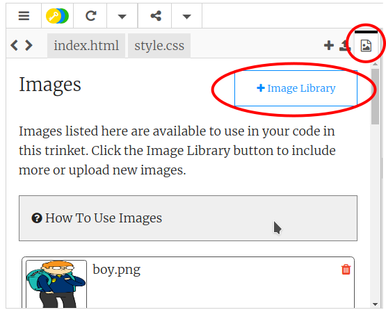

## Caricamento di immagini

__Se hai un account su Trinket__, puoi anche caricare le tue immagini sulla pagina Web!

+ Fai clic sull’icona delle immagini situata nella parte superiore di trinket e quindi su "Add Image" (Aggiungi immagine).

	

+ Trova l’immagine sul computer e trascinala in trinket.

	

+ Puoi quindi aggiungere il nome dell’immagine nuova tra le virgolette del tag ``, nel modo seguente:

	```
	
	```
