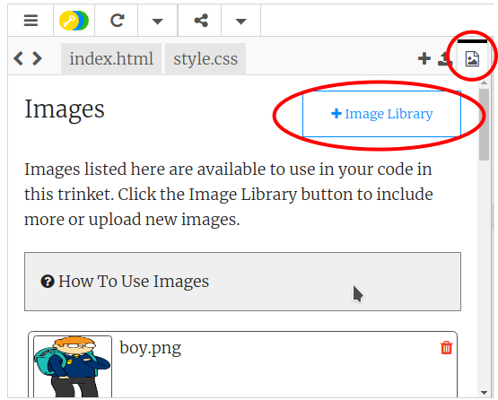
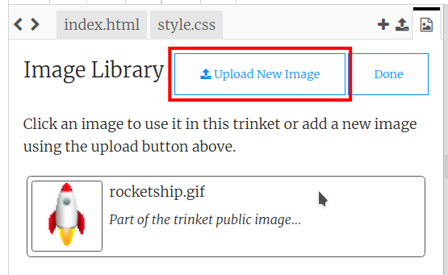

## Carica le immagini

**Se hai un account Trinket**, puoi anche caricare le tue immagini sulla tua pagina web.

+ Clicca sull'icona dell'immagine in cima al tuo trinket, e poi clicca **Add Image**.



+ Clicca il pulsante **Upload** e poi trova l'immagine che vuoi usare sul tuo computer e trascinala nel contenitore. In alternativa, usa il pulsante per selezionarla.



+ Poi aggiungi il nome della tua nuova immagine tra le virgolette del tuo tag ``, in questo modo:

```html

```