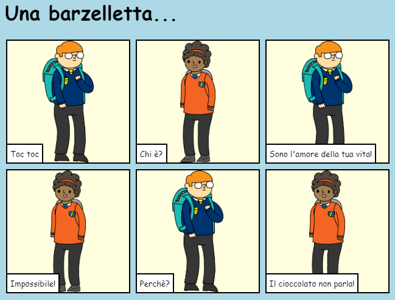

--- challenge ---

## Sfida: continua!

Usa quel che hai imparato in questo progetto per finire di raccontare la tua storia! Ecco un esempio:

--- /challenge ---

**Traduzioni della Community**

Questo progetto è stato tradotto da **Luca Fantin** e revisionato da **Omar Lazzari**.

Il nostro straordinario team di traduttori volontari ci permette di dare ai bambini di tutto il mondo la possibilità di imparare a programmare. Puoi aiutarci a raggiungere più bambini traducendo i nostri progetti - scopri di più su [rpf.io/translators](https://rpf.io/translators).