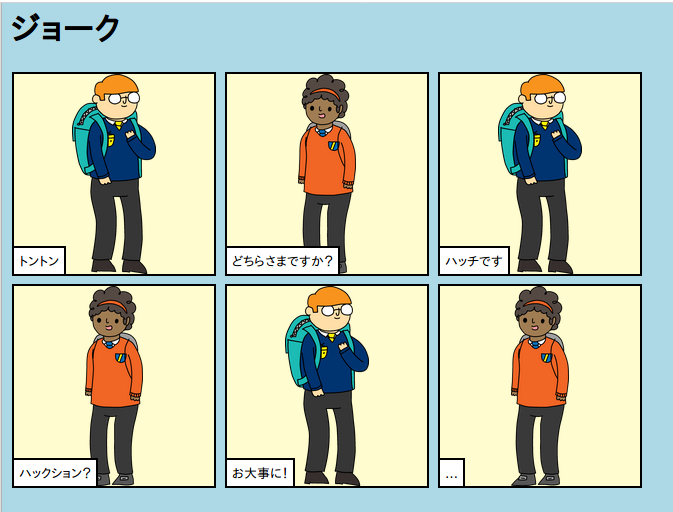

## はじめに

このプロジェクトでは、自分のWebページを作成してストーリー、ジョーク、または詩を伝える方法を学びます。

### 作るもの

小銭を下にスクロールしてパンチラインを見てください！

  <iframe src="https://trinket.io/embed/html/c8afdef912?outputOnly=true&start=result" width="600" height="450" frameborder="0" marginwidth="0" marginheight="0" allowfullscreen>
  </iframe>
  

### あなたが学ぶもの

このプロジェクトは、[ラズベリーパイデジタルメイクカリキュラムの以下の要素をカバーします](http://rpf.io/curriculum) ：

+ [基本的な2Dおよび3Dアセット](https://www.raspberrypi.org/curriculum/design/creator){：target = "_ blank"}を設計します。

### 教育者のための追加情報

このプロジェクトを印刷する必要がある場合は、 [印刷用バージョン](https://projects.raspberrypi.org/en/projects/tell-a-story/print)を使用してください。

フッターのリンクを使用して、このプロジェクトのGitHubリポジトリにアクセスします。このリポジトリには、 'en / resources'フォルダ内のすべてのリソース（完成プロジェクトの例を含む）が含まれています。