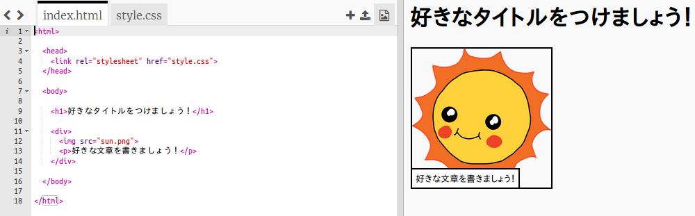
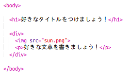
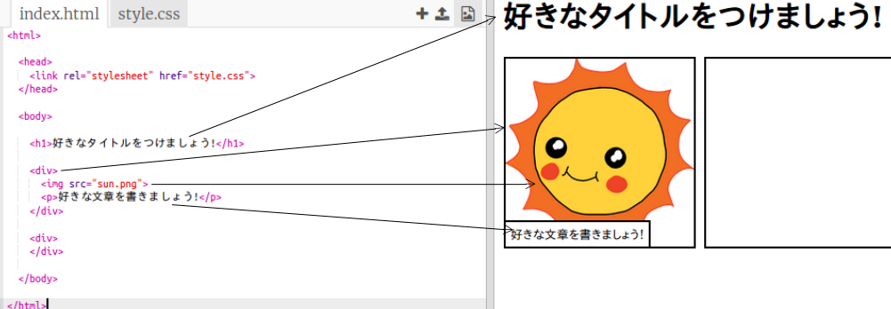

## あなたの話を編集する

まず、ストーリーのWebページのHTMLコンテンツとCSSスタイルを編集してみましょう。

+ [この小物](http://jumpto.cc/web-story){{target = "_ blank"}にしてください。

プロジェクトは次のようになります。

ウェブページのコンテンツは、 `index.html` HTMLドキュメントの `<body>` セクションにあります。

+ 7行目以降のWebページコンテンツを `<body>` と `</body>` タグ内で検索します。

+ ウェブページのさまざまな部分を作成するためにどのタグが使用されているか調べることができます。

## \---崩壊\---

## タイトル：回答

+ `<h1>` は **見出し**です。数字1〜6を使用して、さまざまなサイズの見出しを作成できます。
+ `
` は **分割**略であり、物をまとめてグループ化する方法です。このウェブページでは、ストーリーの各部分のすべてのものをまとめてグループ化するために使用します。
+ `` は **画像**です。
+ `
` はテキストの **段落** です。

\--- /崩壊\---