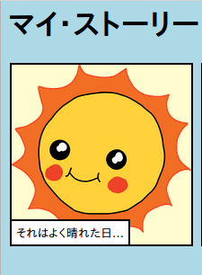

\--- challenge \---

## チャレンジ：いくつかの変更を加える

HTMLコンテンツとCSSコードを編集してウェブページをカスタマイズします。

HTMLコンテンツは `index.html` ファイルにあり、CSSスタイルは `style.css` ファイルにあります。

ウェブページで使用される色を変更することもできます。また、次のような異なるフォントを使用することもできます。

+ Arial
+ Comic Sans MS
+ Impact
+ Tahoma

CSSの他の色の名前を[ここ](http://jumpto.cc/colours){:target="_blank"}で探してみましょう。

\--- /challenge \---