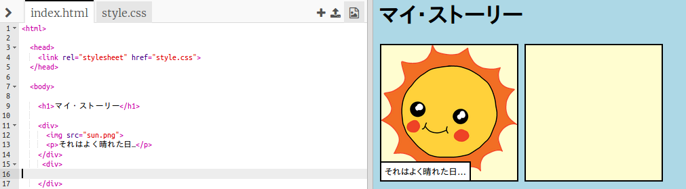
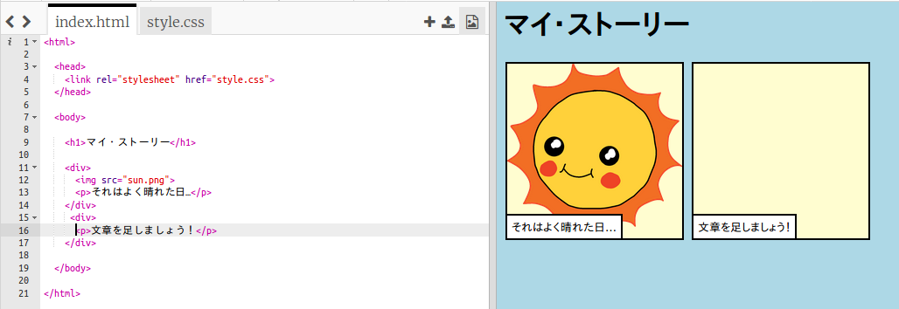
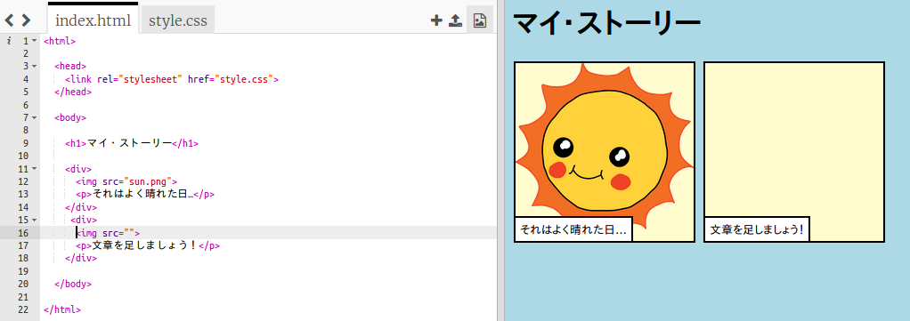
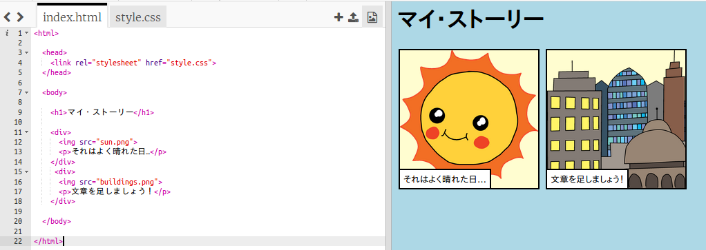

## あなたの物語を伝える

あなたの物語に2番目のパートを追加しましょう。

+ コードの15行目に移動し、別の `<div>` と `</div>` の開始タグと終了タグの組を追加します。これで、あなたの物語の次のパートのための新しいボックスを作成します。



+ 新しい `<div>` タグの中にテキストの段落を追加しましょう：

```html
<p>文章を足しましょう！</p>
```



+ `<div>` タグの中にこのコードを追加すると、新しいボックスに画像を表示できます：

```html

```



`` タグは他のタグとは少し異なります。つまり、終了タグはありません。

+ 画像を表示するには、画像の **情報** (`src`) を" "の内側に追加する必要があります。

画像アイコンをクリックして、あなたの物語で使える画像を見てみましょう。


+ 追加する画像を決めて、その名前を覚えておきます。たとえば、`buildings.png` 。

+ コードに戻るには、 `index.html` をクリックしてください。


+ `` タグの" "の間に画像の名前を追加します。

```html

```

