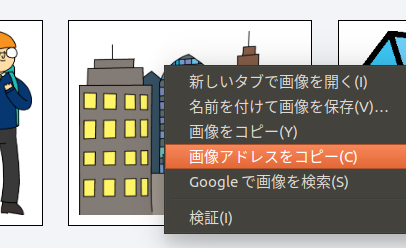
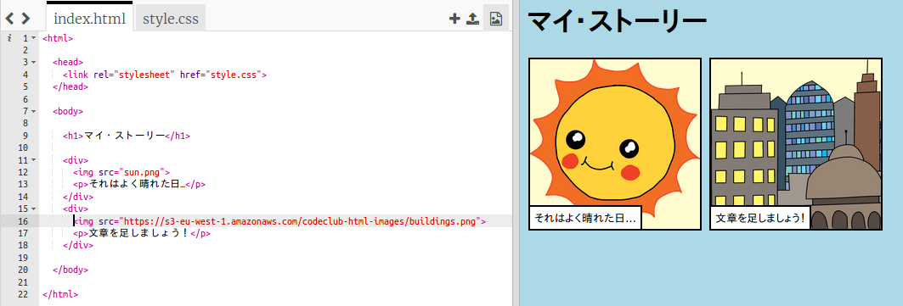

## 自分の画像を見つける

あなたの物語に追加する画像をウェブ上で見つけましょう。

+ [このページ](http://jumpto.cc/html-images){:target="_blank"}に移動して、あなたの物語に含める画像を見つけます。

+ 画像を右クリックし、**画像アドレスをコピー** (または **リンクのアドレスのコピー**、画像のURLをコピーなど、文言は使用しているコンピュータによって変わります) をクリックします。URLとは、画像のアドレスのことです。

+ `index.html` ページに戻ります。

+ `` タグの" "の間にアドレスを貼り付けます。あなたの画像が表示されるはずです！

