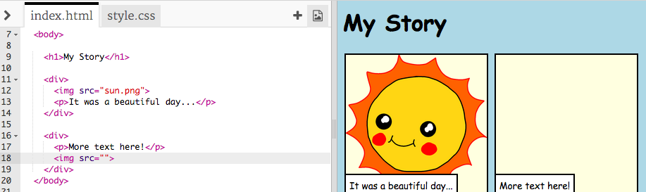

## ನಿಮ್ಮ ಕಥೆಯನ್ನು ಹೀಗೆ ಹೇಳಿ

ನಿಮ್ಮ ಕಥೆಗೆ ಎರಡನೇ ಭಾಗವನ್ನು ಸೇರಿಸೋಣ.

+ ಕೋಡ್‌ನ 15 ನೇ ಸಾಲಿಗೆ ಹೋಗಿ, `<div>` ಮತ್ತು `</div>` ಪ್ರಾರಂಭ ಮತ್ತು ಅಂತ್ಯ ಟ್ಯಾಗ್‌ಗಳನ್ನು ಮತ್ತೊಂದು ಗುಂಪಿನಲ್ಲಿ ಸೇರಿಸಿ. ಇದು ನಿಮ್ಮ ಕಥೆಯ ಮುಂದಿನ ಭಾಗಕ್ಕೆ ಹೊಸ ಬಾಕ್ಸ್ ನ್ನು ರಚಿಸುತ್ತದೆ.


+ ನಿಮ್ಮ ಹೊಸ `<div>` ಟ್ಯಾಗ್ ಒಳಗೆ ಪಠ್ಯದ ಪ್ಯಾರಾಗ್ರಾಫ್ ಸೇರಿಸಿ:

```html
<p>More text here!</p>
```


+ ನಿಮ್ಮ `<div>` ಟ್ಯಾಗ್ ಒಳಗೆ ಈ ಕೋಡ್ ಸೇರಿಸುವ ಮೂಲಕ ನಿಮ್ಮ ಹೊಸ ಬಾಕ್ಸ್ ಒಳಗೆ ಚಿತ್ರವನ್ನು ಪ್ರದರ್ಶಿಸಬಹುದು:

```html

```



`` ಟ್ಯಾಗ್‌ಗಳು ಇತರ ಟ್ಯಾಗ್‌ಗಳಿಗಿಂತ ಸ್ವಲ್ಪ ಭಿನ್ನವಾಗಿವೆ ಎಂಬುದನ್ನು ಗಮನಿಸಿ: ಅವುಗಳಿಗೆ ಅಂತಿಮ ಟ್ಯಾಗ್ ಇಲ್ಲ.

+ ಚಿತ್ರವನ್ನು ತೋರಿಸಲು, ನೀವು ಚಿತ್ರದ **ಮೂಲ** (`src`) ವನ್ನು ಭಾಷಣ ಗುರುತುಗಳೊಳಗೆ ಸೇರಿಸಬೇಕು.

ನಿಮ್ಮ ಕಥೆಗೆ ಲಭ್ಯವಿರುವ ಚಿತ್ರಗಳನ್ನು ನೋಡಲು ಚಿತ್ರದ ಐಕಾನ್ ಕ್ಲಿಕ್ ಮಾಡಿ.


+ ನೀವು ಯಾವ ಚಿತ್ರವನ್ನ ಸೇರಿಸಬೇಕೆಂಬುದನ್ನು ನಿರ್ಧರಿಸಿ ಮತ್ತು ಅದರ ಹೆಸರನ್ನು ನೆನಪಿಟ್ಟುಕೊಳ್ಳಿ, ಉದಾಹರಣೆಗೆ `buildings.png`.

+ ನಿಮ್ಮ ಕೋಡ್‌ಗೆ ಹಿಂತಿರುಗಲು `index.html` ಕ್ಲಿಕ್ ಮಾಡಿ.


+ ನಿಮ್ಮ `` ಟ್ಯಾಗ್‌ನ ಭಾಷಣ ಗುರುತುಗಳ ನಡುವೆ ಚಿತ್ರದ ಹೆಸರನ್ನು ಸೇರಿಸಿ.

```html

```

