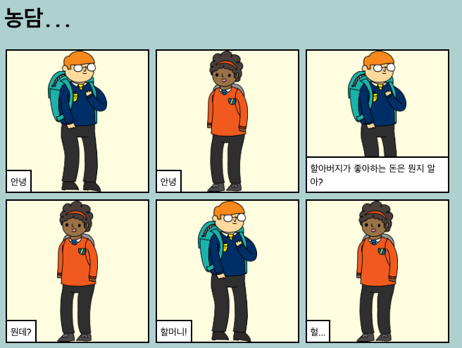

## 소개

이 프로젝트에서는 이야기, 농담, 시 등을 설명하는 웹 페이지를 만드는 방법에 대해 배웁니다.

### 만들 작품

이야기 제작의 예시입니다. 아래로 스크롤하며 구경해 보세요!

  <iframe src="https://trinket.io/embed/html/c8afdef912?outputOnly=true&start=result" width="600" height="450" frameborder="0" marginwidth="0" marginheight="0" allowfullscreen>
  </iframe>
  

### 배울 지식

이 프로젝트는 [라즈베리 파이 디지털 메이킹 커리큘럼](http://rpf.io/curriculum){:target="_blank"}: 중 아래의 과정에 있는 요소들을 다룹니다.

+ [2D와 3D 디자인](https://www.raspberrypi.org/curriculum/design/creator){:target="_blank"}.

### 교육자를 위한 추가 정보

이 프로젝트를 프린트하고자 한다면, [프린트용 버전](https://projects.raspberrypi.org/en/projects/tell-a-story/print){:target="_blank"} 을 사용하십시오.

아래쪽에 있는 이 프로젝트를 위한 GitHub repository 링크를 이용하세요. (완성된 프로젝트 예제를 포함한) 모든 리소스가 'en/resources' 폴더에 들어 있습니다.