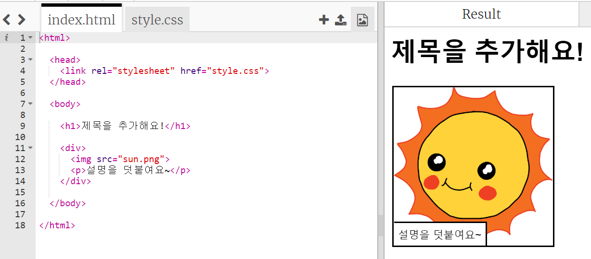
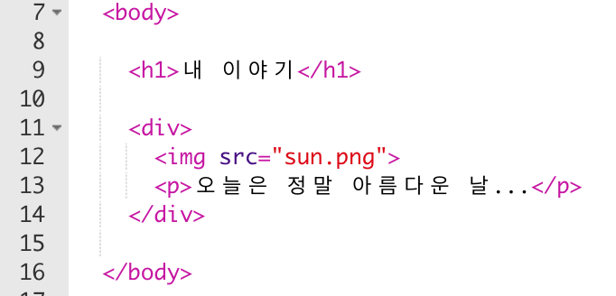
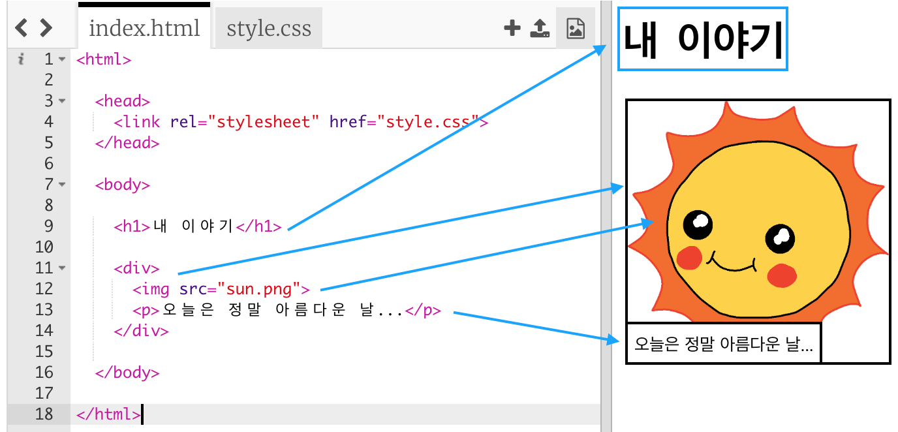

## 이야기 수정하기

이야기 웹 페이지에서 HTML 콘텐츠와 CSS 스타일을 수정해 보도록 하겠습니다.

+ [trinket 열기](http://jumpto.cc/web-story){:target="_blank"}

프로젝트는 아래와 같이 보일 것입니다:

웹 페이지의 내용은 `index.html`의 `<body>` 섹션에 있습니다.

+ 웹페이지 내용은 7번 내용부터이며, `<body>`와 `</body>` 태그 사이에 있습니다.

+ 각각의 내용들이 어떤 태그에 해당되는지 확인해 보세요.

## \--- collapse \---

## title: 정답

+ `<h1>`은 **제목**입니다. 1에서 6까지의 숫자를 사용하여 다양한 크기의 제목을 만들 수 있습니다.
+ `
`은 **division**의 약자로, 레이아웃을 나누는데 주로 쓰입니다. 이 웹페이지에서 이야기의 각 부분에 대한 자료를 그룹화하는데 사용합니다.
+ ``는 **이미지**를 삽입하는 태그입니다. src 속성을 통해 이미지 경로를 지정합니다.
+ `
`은 **문단**의 약자로, 하나의 문단을 만들 때 쓰입니다.

\--- /collapse \---