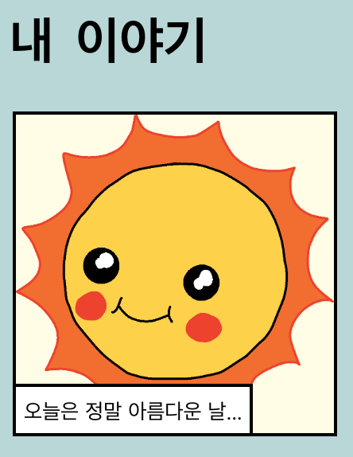

--- challenge ---

## 과제: 몇 가지 변경하기

HTML과 CSS 코드를 웹페이지에 맞게 편집해 보아요.

HTML 내용은 `index.html` 파일에서 찾을 수 있고, CSS 스타일은 `style.css` 파일에서 찾을 수 있습니다.

웹 페이지에서 사용되는 색상을 변경할 수도 있으며 다음과 같은 다양한 글꼴을 사용할 수 있습니다.

+ Arial
+ Comic Sans MS
+ Impact
+ Tahoma

더 많은 CSS 색상을 [여기서](http://jumpto.cc/colours){:target="_blank"} 찾을 수 있어요.

--- /challenge ---