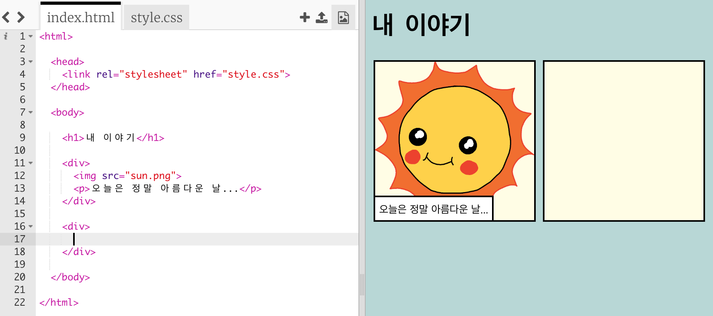
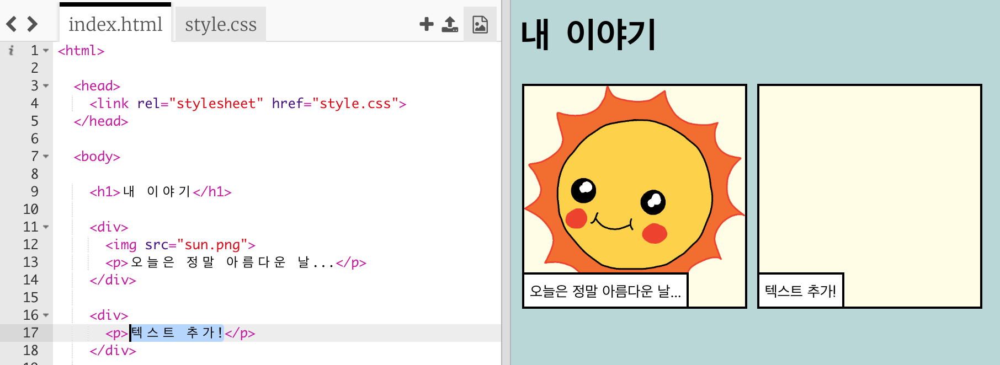
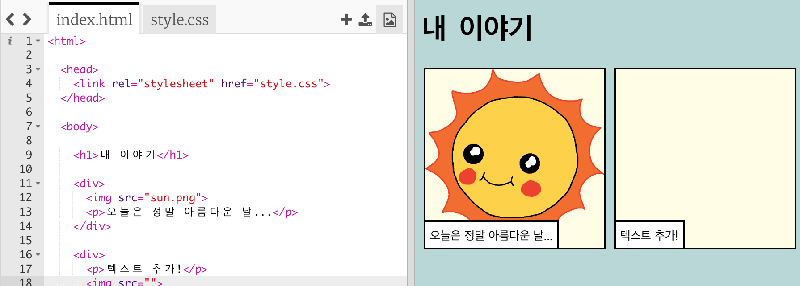
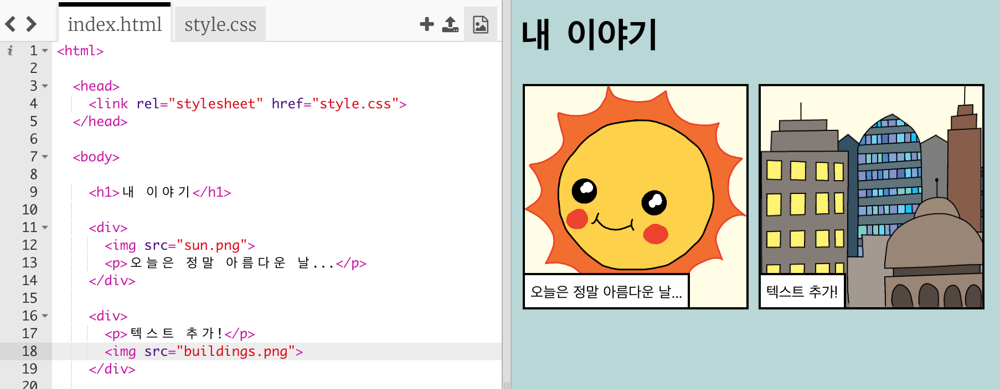

## 이야기를 들려주세요

이제 이야기의 두 번째 부분을 추가해 봅시다.

+ Go to line 15 of the code, and add in another set of `<div>` and `</div>` start and end tags. This will create a new box for the next part of your story.



+ 아래 코드를 새로운 `<div>` 태그 안에 추가하세요.

```html
<p>텍스트 추가!</p>
```



+ You can display an image in your new box by adding this code inside your `<div>` tag:

```html

```



Notice that `` tags are a bit different to other tags: they don't have an end tag.

+ To get an image to show up, you need to add the **source** (`src`) of the image inside the speech marks.

Click the image icon to see the images available for your story.


+ Decide which image you want to add and remember its name, for example `buildings.png`.

+ Click on `index.html` to get back to your code.


+ Add the name of the image between the speech marks in your `` tag.

```html

```

