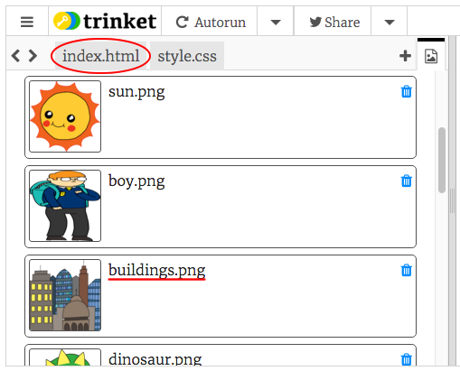

## 이야기를 들려주세요

이제 이야기의 두 번째 부분을 추가해 봅시다.

+ 15번째줄 코드로 가서, `<div>`와 `</div>` 쌍을 추가하세요. 그럼 이야기의 두번째 장을 위한 새로운 공간이 만들어집니다.


+ 아래 코드를 새로운 `<div>` 태그 안에 추가하세요.

```html
<p>텍스트 추가!</p>
```


+ `<div>` 태그에 다음 코드를 추가하여 새로운 공간 안에 이미지를 넣을 수 있습니다.

```html

```


`` 태그는 다른 태그와 다르게 끝 태그가 없다는 점을 주의하세요.

+ 이미지를 표시하기 위해서는 **이미지 소스**(`src`) 를 따옴표 안에 추가해야 합니다.

스토리에서 사용할 수 있는 이미지를 보려면 이미지 아이콘을 클릭하세요.


+ 어떤 이미지를 추가할 지 결정하고 이름을 기억하세요. (예시: `buildings.png`)

+ `index.html`을 클릭하여 원래 코드로 돌아가세요.



+ `` 태그의 src 항목 따옴표 안에 이미지의 이름을 추가하세요.

```html

```

