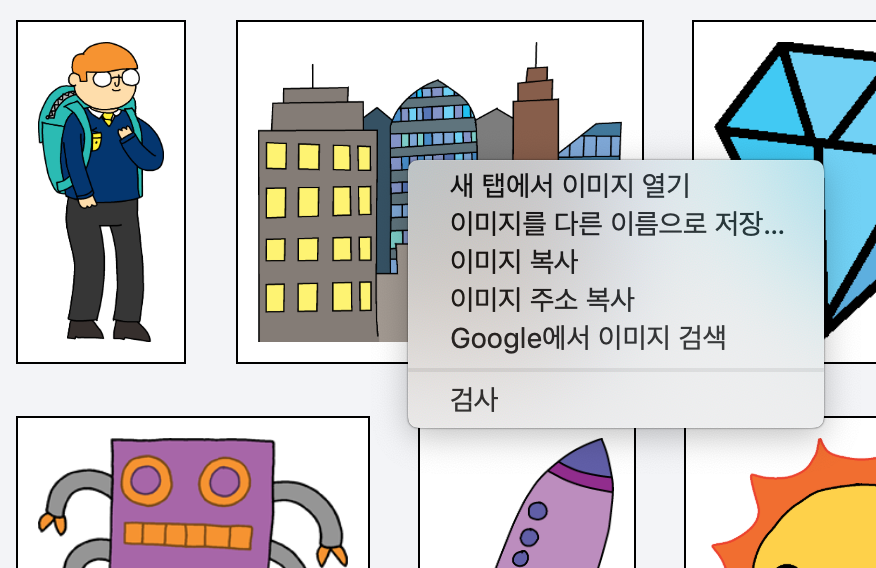
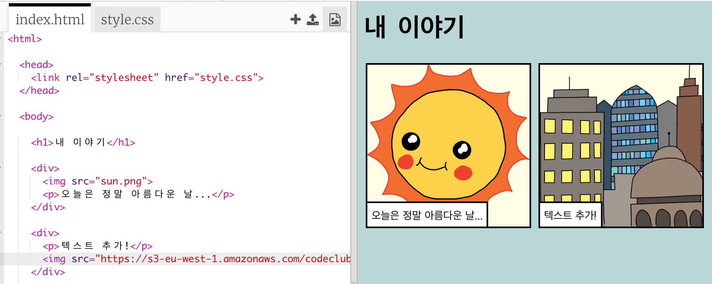

## 나만의 이미지 찾기

이야기에 추가할 이미지를 웹에서 찾아 보아요.

+ [이 페이지](http://jumpto.cc/html-images){:target="_blank"}로 이동하여 스토리에 넣을 이미지를 찾아 보세요.

+ 이미지에 마우스 오른쪽 버튼을 클릭하고, **이미지 복사**를 클릭하세요 (혹은 **이미지 주소 복사**. 사용하고 있는 컴퓨터에 따라 다름). URL은 이미지의 주소를 의미합니다.

+ 다시 `index.html`로 돌아갑니다.

+ `` 태그의 따옴표 사이에 URL을 붙여 넣으세요. 그럼 이미지가 나타납니다!

