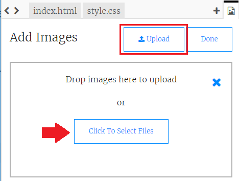

## 이미지 업로드하기

**Trinket 계정이 있는 경우**, 자신의 이미지를 페이지에 올릴 수 있어요.

+ Click on the image icon at the top of your trinket, and then click **Add Image**.


+ **업로드**를 클릭하고, 사용하고 싶은 이미지를 찾아 드래그하거나, 버튼을 사용하여 선택하세요.



+ Then just add the name of your new image between the speech marks in your `` tag, like this:

```html

```